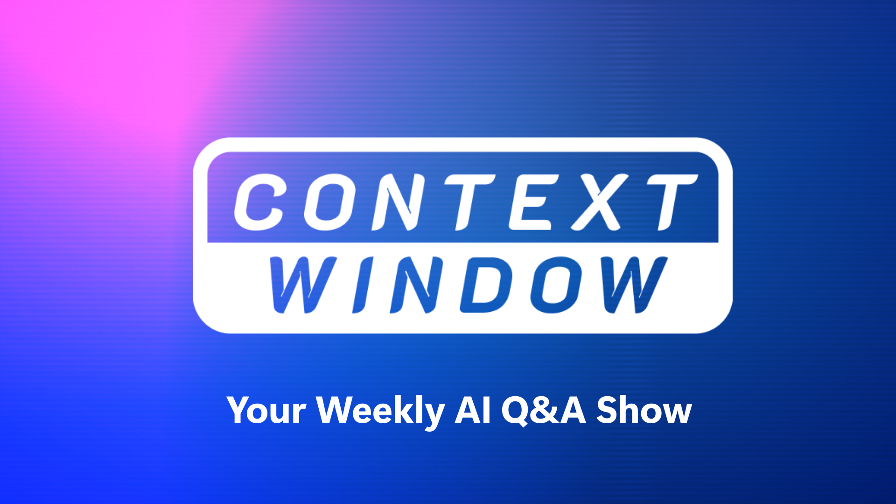

# Context Window - Your Weekly AI Question and Answer Show

## Introduction

The Context Window is a weekly show that covers some of the best AI engineering questions from the [Azure AI Foundry Community](https://aka.ms/foundry-devs).

## Join the Community! 

You can join the Azure AI Foundry Community of over 30,000 developers through the following links:

### [Discord](https://aka.ms/context-window/discord)

Chat with other developers and AI Engineers, attend live community sessions hosted by Azure product teams and get support from product experts.

### [Github Discussion](https://aka.ms/context-window/gh)

Get your questions answered about Azure AI Foundry, share your feedback, and discuss ideas with the community.

## Episode Resources

Listed below are the resources for each episode of Context Window:

| **Episode**                                      | **Video Link** | **Resources Link** |
|--------------------------------------------------|----------------|--------------------|
| Control Your AI Agents, AI Projects, Better RAG  |                |[Resources](./episodes/ep-1-control-ai-agents.md)                    |
|                                                  |                |                    |
