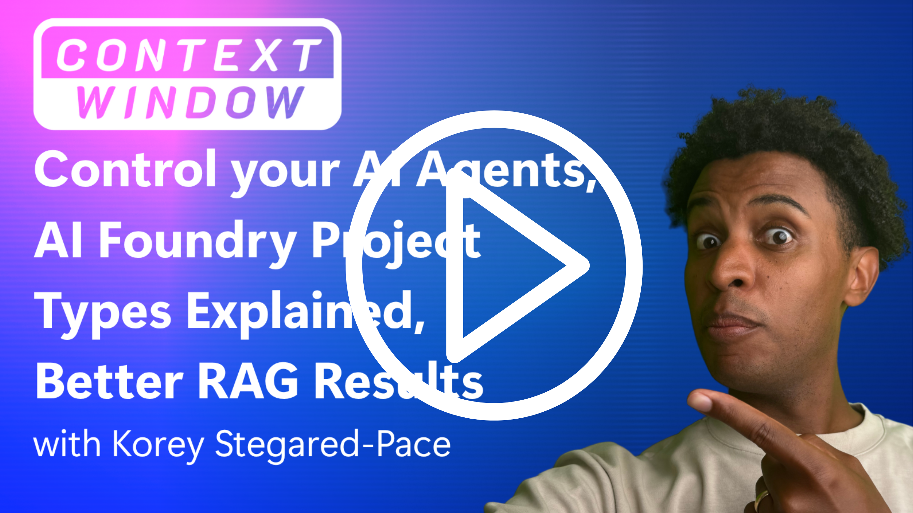

# Episode 1: Control Your AI Agents, AI Projects Explained, Better RAG

(https://www.youtube.com/watch?v=IMQbZTmAIZo)

## Resources

### Question 1 - How do I control my AI agents better?

[ChatHistorySummarizationReducer Class](https://learn.microsoft.com/en-us/python/api/semantic-kernel/semantic_kernel.contents.chathistorysummarizationreducer?view=semantic-kernel-python)

[Code sample](https://github.com/microsoft/semantic-kernel/blob/main/python/samples/concepts/chat_completion/simple_chatbot_with_summary_history_reducer.py)

[Walkthrough](https://deepwiki.com/microsoft/SemanticKernelCookBook/4.3-agent-orchestration)

### Question 2 - What is the difference between different AI project types in Azure AI Foundry?

[AI Project Types Overview](https://learn.microsoft.com/en-us/azure/ai-foundry/what-is-azure-ai-foundry#project-types)

[How to Create an Project in Foundry](https://learn.microsoft.com/en-us/azure/ai-foundry/how-to/create-projects?tabs=ai-foundry&pivots=hub-project) 

### Question 3 - How can I improve my RAG (Retrieval-Augmented Generation) implementation?

[Tutorial: Build an indexing pipeline for RAG on Azure AI Search](https://learn.microsoft.com/en-us/azure/search/tutorial-rag-build-solution-pipeline)

[Index data from Azure Blob Storage
](https://learn.microsoft.com/en-us/azure/search/search-howto-indexing-azure-blob-storage)

[Semantic Ranking in Azure AI Search](https://learn.microsoft.com/en-us/azure/search/semantic-search-overview)

